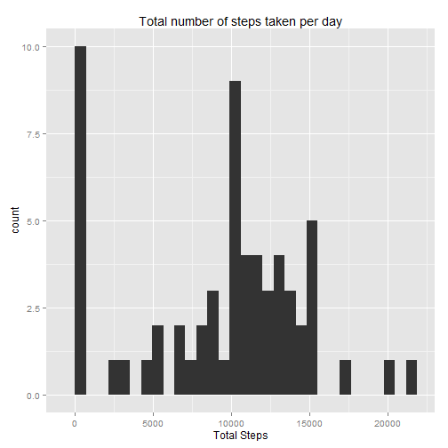

This assignment will be described in multiple parts. The report will answer the questions detailed below.

## Loading and preprocessing the data
1.  Loading the data using read.csv function.  
2.  Convert the date column to Date type using as.Date function.

```r
dataset<-read.csv("activity.csv",header = TRUE,na.strings = "NA",stringsAsFactors = FALSE)
dataset$date<-as.Date(dataset$date)
```

## What is mean total number of steps taken per day?
The answer can be described by the following:

1. A histogram of the total number of steps taken each day, achieved by the following steps:  
   + Loading dplyr, and ggplot2 libraries  
   + Calculate and store the total number of steps taken each day    
   + Draw a histogram of the total number of steps taken each day  
2. Calculating the mean and median total number of steps taken per day


```r
library(dplyr)
library(ggplot2)

day.stepsTotal<- dataset %>% group_by(date) %>% summarize(stepsTotal=sum(steps,na.rm = TRUE))

qplot(data=day.stepsTotal,stepsTotal,geom="bar") + labs(x = "Total Steps",title="Total number of steps taken per day")
```

```
## stat_bin: binwidth defaulted to range/30. Use 'binwidth = x' to adjust this.
```

 

```r
mean(day.stepsTotal$stepsTotal)
```

```
## [1] 9354.23
```

```r
median(day.stepsTotal$stepsTotal)
```

```
## [1] 10395
```

## What is the average daily activity pattern?
The answer can be described by the following:

1. Makeing a time series plot of the 5-minute interval (x-axis) and the average number of steps taken, averaged across all days (y-axis).  
+ Calcuate and store the average number of steps taken, averaged across all days
+ Plot the 5-minute interval (x-axis) and the average number of steps taken, averaged across all days (y-axis). 

2. Disply which 5-minute interval, on average across all the days in the dataset, contains the maximum number of steps.


```r
interval.stepsAvg<- dataset %>% group_by(interval) %>% summarize(stepsAvg=mean(steps,na.rm = TRUE))

qplot(data=interval.stepsAvg,interval,stepsAvg,geom = c("line"))+labs(x="5-minite interval",y="Average number of steps")
```

 

```r
interval.stepsAvg[[which.max(interval.stepsAvg$stepsAvg),"interval"]]
```

```
## [1] 835
```

## Imputing missing values
Note that there are a number of days/intervals where there are missing values (coded as NA). The presence of missing days may introduce bias into some calculations or summaries of the data.  

1. Calculate and report the total number of missing values in the dataset.

2. Devise a strategy for filling in all of the missing values in the dataset. The strategy does not need to be sophisticated. **I have used the mean for that 5-minute interval for filling.**
3. Create a new dataset that is equal to the original dataset but with the missing data filled in.

4. Make a histogram of the total number of steps taken each day and Calculate and report the mean and median total number of steps taken per day.

   + Calculate and store the total number of steps taken each day
   + Draw a histogram of the total number of steps taken each day  
   + calculate the mean and median total number of steps taken per day 


```r
sum(is.na(dataset$steps))
```

```
## [1] 2304
```

```r
dataset.WithFillingNAs<-mutate(.data = dataset,steps=ifelse(is.na(steps),interval.stepsAvg[interval.stepsAvg$interval==interval,"stepsAvg"]$stepsAvg,steps))

day.stepsTotal.withFillingNa<- dataset.WithFillingNAs %>% group_by(date) %>% summarize(stepsTotal=sum(steps,na.rm = TRUE))

qplot(data=day.stepsTotal.withFillingNa,stepsTotal,geom="bar") + labs(x = "Total Steps",title="Total number of steps taken per day")
```

```
## stat_bin: binwidth defaulted to range/30. Use 'binwidth = x' to adjust this.
```

 

```r
mean(day.stepsTotal.withFillingNa$stepsTotal)
```

```
## [1] 9530.724
```

```r
median(day.stepsTotal.withFillingNa$stepsTotal)
```

```
## [1] 10439
```

## Are there differences in activity patterns between weekdays and weekends?
1. Create a new factor variable in the dataset with two levels - "weekday" and "weekend" indicating whether a given date is a weekday or weekend day.  

2. Make a panel plot containing a time series plot of the 5-minute interval (x-axis) and the average number of steps taken, averaged across all weekday days or weekend days (y-axis). 


```r
library(chron)
dataset.WithFillingNAs<-mutate(.data = dataset.WithFillingNAs, dayCategory=ifelse(is.weekend(date),"weekend","weekday"))


interval.WithFillingNA.stepsAvg<- dataset.WithFillingNAs %>% group_by(dayCategory,interval) %>% summarize(stepsAvg=mean(steps,na.rm = TRUE))

qplot(data=interval.WithFillingNA.stepsAvg,interval,stepsAvg,facets = dayCategory ~ ., geom = c("line"))+labs(x="5-minite interval",y="Average number of steps")
```

 
